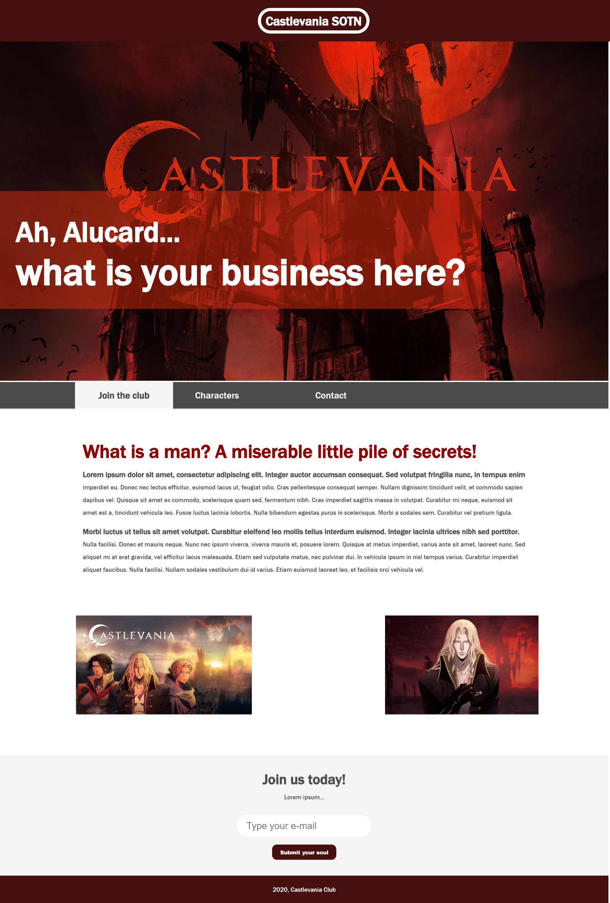

# Castlevania Club

<b>Made with:</b><br/>
HTML, CSS
<br/><br/>
<b>What is this?</b><br/>
Website
<br/><br/>
<b>Description:</b><br/>
A website of a Castlevania Fan Club
<br/><br/>
# Quick links &#128150;
<div>
  
[PROJECT SETUP](#Project-setup) &diams; [PREVIEW](#Preview) &diams; [STATUS OF THE PROJECT](#How-is-the-development-of-the-project-right-now) &diams; [BACK TO TOP](#Castlevania-Club)

<div>

# Project setup
```
Open the index.html at your browser ;D
```

<b>Thank you for your support!</b>

# Preview



# How is the development of the project right now?
<b>Last update:</b> 13/12/2020

first version is finished, needs improvements ^-^

<br/>

<div>
  
[PROJECT SETUP](#Project-setup) &diams; [PREVIEW](#Preview) &diams; [STATUS OF THE PROJECT](#How-is-the-development-of-the-project-right-now) &diams; [BACK TO TOP](#Castlevania-Club)

<div>
